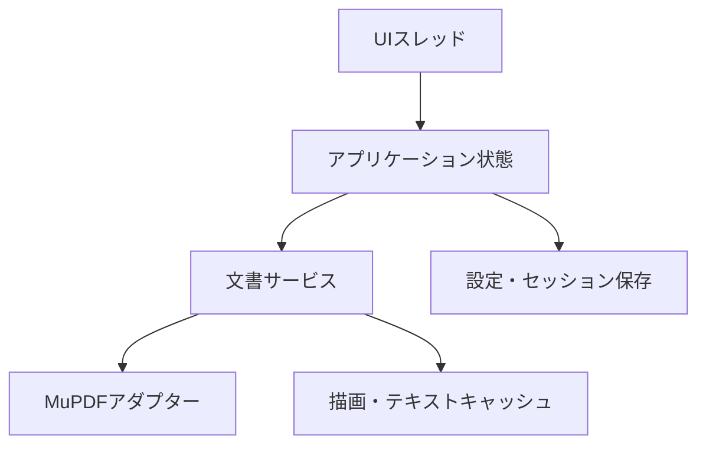

# 軽量PDFビューワー 実装計画・基本設計書

更新日：2026-07-18
状態：初期設計
対象：個人利用のWindowsおよびLinux向けデスクトップアプリケーション

## 1. 設計判断

初期版は、MuPDFをPDFエンジンに使う軽量なタブ式ビューアとして実装する。

実装言語はRustを第一候補とする。

GUIは`egui`と`eframe`を暫定採用し、OpenGL系の`glow`バックエンドから検証する。

ただし、GUIツールキットは性能検証を通過するまで確定としない。

初期プロトタイプがメモリ目標を超える場合は、Slintを同じPDFバックエンドに接続して比較する。

初期版の機能は、PDF表示、最大20タブ、文字検索、文字選択とコピー、PDF標準のハイライト注釈、目次、サムネイル、セッション復元に限定する。

注釈はPDF本体へ保存し、注釈用の永続的な別ファイルは作らない。

Typst生成PDFの文字選択範囲は、実装を約束する前に専用プロトタイプで改善可能性を検証する。

## 2. 背景と目的

既存の軽量PDFビューワーに近い起動速度と操作密度を保ちながら、複数の論文やスライドをタブで開ける個人用ビューアを作る。

対象文書は、50ページから100ページ程度の論文、Typstで生成した文書やスライド、一般的な技術資料である。

スキャンPDF向けOCR、共同編集、クラウド同期、高度なPDF編集は対象外とする。

自作する理由の一つに、Typst生成PDFをMuPDF系ビューアで選択したとき、選択範囲が文字の見た目より広くなる問題がある。

この問題はPDF内の文字座標、MuPDFの構造化テキスト生成、ビューア側の選択表示のいずれでも発生し得る。

したがって、原因を特定せずに独自補正を本実装へ組み込まない。

## 3. 初期版の要件

### 3.1 機能要件

| ID | 要件 | 初期版の受け入れ条件 |
| --- | --- | --- |
| F-01 | PDFを開く | OSからPDFを関連付けて起動でき、ウィンドウへのドラッグ＆ドロップでも開ける |
| F-02 | タブ管理 | 最大20個のPDFを開け、タブの選択と閉鎖ができる |
| F-03 | 連続表示 | ページを縦に連続表示し、通常のホイール操作で連続スクロールできる |
| F-04 | 単ページ表示 | 1ページ単位の表示へ切り替えられる |
| F-05 | ページ単位移動 | 連続表示中でも`PageUp`、`PageDown`または設定した入力で前後ページの先頭へ移動できる |
| F-06 | 拡大縮小 | 拡大、縮小、幅に合わせる、ページ全体に合わせるを利用できる |
| F-07 | 目次 | 折りたたみ式サイドバーにPDFの目次を表示し、項目から移動できる |
| F-08 | サムネイル | 同じサイドバーで目次とサムネイルを切り替えられる |
| F-09 | 文字検索 | `Ctrl+F`で検索し、前後の一致箇所へ移動できる |
| F-10 | 文字選択 | マウスドラッグでテキストを選択し、`Ctrl+C`でコピーできる |
| F-11 | ハイライト | 選択範囲からPDF標準のHighlight注釈を作成できる |
| F-12 | 保存 | 変更後は未保存状態を示し、`Ctrl+S`でPDF本体へ保存できる |
| F-13 | 終了確認 | 未保存のPDFを閉じるとき、保存、破棄、キャンセルを選べる |
| F-14 | セッション復元 | 終了時のタブ、選択中タブ、各PDFの表示位置を次回起動時に復元できる |
| F-15 | 復元設定 | セッション復元を設定で無効化できる |

初期版にはファイル選択ダイアログを含めない。

同じPDFを再度開いた場合は、新しいタブを増やさず既存タブへ移動する。

20個を超えて開こうとした場合は、既存タブを暗黙に閉じず、上限到達を通知する。

### 3.2 非機能要件

| ID | 要件 | 暫定目標 |
| --- | --- | --- |
| N-01 | 対応OS | Windows 11および主要なLinuxデスクトップ環境 |
| N-02 | UI応答性 | PDF処理中もUIスレッドをブロックせず、100 msを超える停止を通常操作で発生させない |
| N-03 | 初期表示 | 通常の論文PDFで、開く操作から最初のページ表示まで500 ms以内を目標とする |
| N-04 | 起動時間 | 一般的なSSD環境で、通常起動からウィンドウ表示まで1秒以内を目標とする |
| N-05 | メモリ | 通常PDFを20タブ開いて安定した状態で512 MiB以内を目標とする |
| N-06 | キャッシュ上限 | ページ画像とGPUテクスチャの総量に明示的な上限を設ける |
| N-07 | 保存互換性 | 保存したハイライトを別の標準的なPDFビューアで表示できる |
| N-08 | 入力機器 | マウスとキーボードを対象とし、タッチ操作は対象外とする |

数値目標は設計上の基準であり、現時点の実測値ではない。

最初の技術検証で測定し、画質を落とさず達成できる範囲へ調整する。

### 3.3 初期版に含めない機能

- OCR
- 付箋、下線、取り消し線、手書きなど、ハイライト以外の注釈
- PDFページの追加、削除、並べ替え
- フォーム編集と電子署名
- クラウド同期
- プラグイン機構
- タッチ操作
- 検索結果専用サイドバー
- リンク先のプレビュー表示
- 永続的な注釈サイドカーファイル

PDF内リンクの移動と外部URLの表示は将来機能とする。

初期版では、後からリンクのホバー処理とクリック処理を追加できるよう、ページ上のヒットテストを独立した層に置く。

## 4. 技術選定

### 4.1 PDFエンジン

PDFエンジンにはMuPDFを採用する。

MuPDFはページ描画、構造化テキスト、検索、目次、リンク、PDF注釈、PDF保存を一つのエンジンで扱える。

公式APIでは、構造化テキストから選択範囲のQuadとコピー文字列を取得できる。

Highlight注釈はPDFのQuadPointsを使う標準的なテキストマークアップとして作成できる。

Rustからは`mupdf`クレートを使う。

現行の高水準ラッパーは、文書の表示とテキスト抽出に加え、注釈とPDF保存を公開している。

不足するAPIが見つかった場合だけ、`mupdf-sys`を小さなアダプター内で使用する。

アプリケーション全体へ生のFFI型を漏らさない。

| 候補 | 利点 | 欠点 | 判断 |
| --- | --- | --- | --- |
| MuPDF | 軽量なCコア、描画品質、テキスト処理、標準注釈、保存を一体で扱える | AGPLまたは商用ライセンス、文書オブジェクトの並行利用に制約がある | 採用 |
| PDFium | PDF描画の実績があり、Chromium全体を組み込む必要はない | Rustから注釈作成と保存まで一貫して扱う層を別途検証する必要がある | 予備候補 |
| Poppler | Linuxでの実績があり、PDF機能が広い | Rust中心の小規模アプリではC++やQtとの境界が増える | 不採用 |

MuPDF本体と`mupdf-rs`はAGPL-3.0で公開されている。

完全な個人利用では配布要件が実務上の障害になりにくいが、将来バイナリを配布したりソースを公開したりする場合はライセンス条件を再確認する。

参照：

- [MuPDF 1.28.0 documentation](https://mupdf.readthedocs.io/en/1.28.0/)
- [StructuredText selection API](https://mupdf.readthedocs.io/en/1.28.0/reference/javascript/types/StructuredText.html)
- [PDFAnnotation types](https://mupdf.readthedocs.io/en/1.28.0/reference/javascript/types/PDFAnnotation.html)
- [PDF write options](https://mupdf.readthedocs.io/en/1.28.0/reference/common/pdf-write-options.html)
- [mupdf-rs](https://github.com/messense/mupdf-rs)

### 4.2 GUI

GUIは`egui`と`eframe`を暫定採用する。

この構成はWindowsとLinuxを同じRustコードで扱え、PDFページをGPUテクスチャとして配置する独自キャンバスを作りやすい。

初期版はSumatraPDFに近い最小限のUIを目指すため、OS標準部品と完全に同じ外観は要件にしない。

`eframe`の描画バックエンドは、依存関係と起動コストを抑えるため`glow`から測定する。

`wgpu`は描画互換性や性能上の必要が確認された場合だけ比較する。

| 候補 | 利点 | 欠点 | 判断 |
| --- | --- | --- | --- |
| eguiとeframe | Rustのみで実装でき、独自キャンバス、パネル、タブ、入力処理をまとめやすい | 即時モードであり、API変更が比較的多く、ネイティブ風の外観ではない | 暫定採用 |
| Slint | 軽量性を重視し、WindowsとLinuxを扱え、宣言的UIを分離できる | 大きな仮想スクロール領域とPDFテクスチャ管理の実装を別途検証する必要がある | 性能不合格時の比較対象 |
| Qt | デスクトップUIとPDF周辺機能が成熟している | C++または言語境界、配布物、依存関係が大きくなる | 初期版では不採用 |

参照：

- [egui documentation](https://docs.rs/crate/egui/latest)
- [Slint](https://slint.dev/)

### 4.3 依存関係の方針

MuPDFクレートの既定機能は、そのまま有効にしない。

既定構成にはPDF閲覧に不要な文書形式、JavaScript、OCRなどが含まれるため、PDFと必要なフォント処理だけを有効にする。

正確なCargo feature名は、実装開始時に採用するクレート版のメタデータから確定する。

アプリケーション設定とセッションは`serde`とJSONで保存する。

OS別の設定ディレクトリ解決には、専用の小さなライブラリを使い、パス規則をアプリケーションロジックへ埋め込まない。

## 5. UI設計

### 5.1 画面構成

画面は、上からタブバー、簡潔なツールバー、本文領域の順に配置する。

本文領域の左側には、必要なときだけ開くサイドバーを置く。

サイドバー内では「目次」と「サムネイル」を切り替える。

ツールバーには、サイドバー切り替え、前後ページ、ページ番号、表示倍率、表示モード、検索を置く。

常時使わない設定項目はツールバーへ並べない。

タブにはファイル名を表示し、未保存の変更がある場合は印を付ける。

### 5.2 表示モード

**連続表示**では、全ページの論理的な配置だけを計算し、画面内とその近傍にあるページだけを描画する。

画面外ページの高解像度画像は保持しない。

**単ページ表示**では、選択中の1ページを中央へ配置する。

両モードは同じページ番号、倍率、ページ内位置を共有し、切り替えで不自然に離れたページへ移動しない。

連続表示中の通常ホイールは連続スクロールとする。

`PageUp`と`PageDown`は前後ページの先頭へ移動する。

1ノッチで1ページ移動するホイール動作は設定項目として追加できる構造にする。

### 5.3 基本操作

| 操作 | 動作 |
| --- | --- |
| PDFをウィンドウへドロップ | 新しいタブで開く |
| OSからPDFを開く | 起動中のインスタンスへ渡せる場合はタブを追加し、それ以外は新規起動する |
| `Ctrl+F` | 検索バーを開く |
| `Enter`、`Shift+Enter` | 次または前の検索結果へ移動する |
| マウスドラッグ | テキストを選択する |
| `Ctrl+C` | 選択文字列をコピーする |
| `H`または右クリックメニュー | 選択範囲を黄色でハイライトする |
| `Ctrl+S` | PDFへ変更を保存する |
| `Ctrl+Tab` | 次のタブへ移動する |
| `PageUp`、`PageDown` | ページ単位で移動する |
| `Ctrl+マウスホイール` | 拡大または縮小する |

初期版のハイライト色は黄色一色とする。

複数色は、保存互換性とUIを確認した後の追加機能とする。

## 6. アーキテクチャ

### 6.1 構成



UIは描画と入力受付だけを担当し、MuPDFを直接呼ばない。

アプリケーション状態は、タブ、表示位置、選択、検索、未保存状態を保持する。

文書サービスは、ページ描画、構造化テキスト抽出、検索、目次取得、注釈作成、保存をコマンドとして受け取る。

MuPDFアダプターは、Rustラッパーと必要最小限のFFIを隠蔽する。

### 6.2 スレッドモデル

MuPDFの公式例では、一つの文書へ同時に複数スレッドからアクセスできない。

一方、文書から作成済みのDisplayListは、クローンしたコンテキストを使って別スレッドで描画できる。

初期実装は安全性を優先し、各文書のMuPDF操作を一つの所有ワーカー上で直列化する。

UIスレッドと文書ワーカーはメッセージで通信する。

検索は1ページずつ処理し、各ページの間で高優先度の表示要求を受け付ける。

これにより、全文検索中でも現在ページの描画を優先できる。

初期実装で描画並列性が不足した場合は、文書ワーカーがDisplayListを生成し、クローンしたMuPDFコンテキストを持つ描画プールへ渡す。

この拡張は、Rustラッパーの所有権と`Send`制約をプロトタイプで確認してから行う。

参照：[MuPDF multi-threaded example](https://mupdf.readthedocs.io/en/1.28.0/cookbook/c/multi-threaded.html)

### 6.3 コマンド

文書サービスの境界では、少なくとも次のコマンドを定義する。

```text
OpenDocument(path)
CloseDocument(document_id)
RenderTile(document_id, page, scale, clip, revision, priority)
LoadTextPage(document_id, page)
SearchPage(document_id, page, query)
LoadOutline(document_id)
LoadThumbnail(document_id, page)
CreateHighlight(document_id, page, quads, color)
SaveDocument(document_id)
```

各要求には世代番号を付ける。

ズーム変更やタブ切り替えの後に古い描画結果が返ってきても、世代番号が一致しなければ破棄する。

### 6.4 文書状態

| 状態 | 説明 |
| --- | --- |
| Opening | PDFを開いて基本情報を取得している |
| ReadyClean | 表示可能で、未保存変更がない |
| ReadyDirty | ハイライトが追加され、未保存変更がある |
| Saving | PDFを保存している |
| Suspended | タブ状態だけを残し、文書と大きなキャッシュを解放している |
| Error | オープン、描画または保存に失敗した |

長時間使っていない非アクティブタブは、メモリ上限に達したときだけ`Suspended`へ移す。

再選択時は同じファイルを再度開き、保存日時とサイズの変化を確認してから表示を復元する。

未保存文書は停止状態へ移さない。

## 7. 描画とキャッシュ

### 7.1 仮想ページ配置

連続表示では、各ページの論理サイズとページ間隔から累積Y座標を計算する。

現在のスクロール範囲と交差するページを二分探索で求める。

これにより、100ページの文書でも100個の画像ウィジェットを常時生成しない。

倍率変更時は論理配置を再計算し、変更前に画面中央にあったPDF座標をアンカーとして表示位置を復元する。

### 7.2 タイル描画

ページ全体を常に1枚のRGBA画像へ展開すると、高倍率でメモリが急増する。

ページは512 pxまたは1024 px単位のタイルとして描画する。

タイル寸法はプロトタイプでGPUアップロード回数とメモリのバランスを測って決める。

キャッシュキーには、文書ID、ページ番号、倍率、DPI、回転、タイル座標、文書の改訂番号を含める。

ハイライト追加後は文書の改訂番号を増やし、古いページ画像を表示し続けない。

### 7.3 優先順位

描画要求は次の順で処理する。

1. アクティブタブの可視タイル
2. アクティブタブの次の画面範囲
3. アクティブタブの前の画面範囲
4. サムネイル
5. 非アクティブタブの事前描画

非アクティブタブの高解像度事前描画は原則として行わない。

### 7.4 メモリ予算

初期値として、CPU側ページ画像に192 MiB、GPUテクスチャに192 MiB、サムネイルに32 MiBの上限を設ける。

上限値は設定ファイルから変更可能にしても、初期UIには露出させない。

キャッシュはバイト数を重みとするLRUで削除する。

20タブという数だけでキャッシュを20等分せず、現在見ている文書へ優先的に割り当てる。

## 8. 文字選択とTypst PDFの検証

### 8.1 選択モデル

文書ワーカーは、可視ページについて文字、論理順序、文字ごとのQuad、行情報をRust所有のスナップショットへ変換する。

UIはこのスナップショットを使ってマウス位置を文字へ対応付ける。

ドラッグ中にMuPDFへ同期問い合わせを繰り返さない。

選択には二つの情報を分けて持つ。

- **論理選択**：コピーする文字列と文字範囲
- **表示選択**：画面へ重ねるQuad群

表示範囲を補正しても、コピー順序まで同時に変更しない。

この分離により、Typst PDFの見た目だけを改善できる場合は、コピー処理への影響を抑えられる。

### 8.2 検証用PDF

次のPDFを固定テスト資料として用意する。

- 問題が再現する実際のTypst PDF
- 日本語と英数字を含む単純な1段組文書
- 2段組の論文
- 数式、上付き、下付き、合字を含む文書
- スライド
- 回転文字または縦書きを含む境界事例
- 比較用のLaTeXまたは一般的なPDF生成器による文書

### 8.3 検証する方式

1. MuPDF標準の選択Quadとコピー結果を基準として記録する。
2. 文字ごとのQuadと行情報を取得し、広がりがPDF内の座標に由来するか確認する。
3. 表示Quadだけを行方向に縮める補正を試す。
4. 文字単位のヒットテストと論理順序を独自実装した場合の回帰を確認する。
5. 補正したQuadからPDF標準ハイライトを作り、別ビューアで位置を確認する。

次の条件を満たす場合だけ独自補正を採用する。

- 隣接行や別段の文字を誤って選ばない
- 日本語、英数字、数式でコピー文字列が標準処理より悪化しない
- 拡大率を変えても選択位置がずれない
- 作成したハイライトを他のPDFビューアで同じ位置に表示できる
- 問題のTypst PDFで見た目の改善を確認できる

条件を満たさない場合、初期版はMuPDF標準の選択を使う。

検証結果は、標準方式を採用した場合も記録として残す。

## 9. ハイライトと保存

### 9.1 注釈形式

ハイライトはPDF標準の`Highlight`注釈として作成する。

選択された行ごとのQuadを`QuadPoints`へ設定する。

独自の描画命令だけをページへ焼き込まない。

この方式により、MuPDF以外の一般的なPDFビューアでも注釈として認識できる状態を目指す。

### 9.2 保存手順

ハイライト作成直後はメモリ上のPDF文書だけを変更し、タブを未保存状態にする。

`Ctrl+S`を受けた文書ワーカーが保存を実行する。

保存前には、オープン時のファイル識別情報、サイズ、更新日時と現在値を比較する。

外部変更を検出した場合は上書きせず、ユーザーへ通知する。

MuPDFが安全に増分保存できるPDFでは、増分更新を優先する。

増分保存できず全体書き換えが必要な場合は、同じディレクトリへ一時ファイルを書き、成功を確認してから元ファイルと置き換える。

一時ファイルは成功後に残さず、注釈用サイドカーや恒久的なバックアップは作らない。

一時ファイルを使わず元ファイルへ直接全体書き換えすると、途中で失敗したときに原本を壊すため、この経路は採用しない。

保存後は文書を再オープンし、ページ数と追加したHighlight注釈を確認してから未保存状態を解除する。

読み取り専用ファイル、編集権限のない暗号化PDF、署名保護されたPDFでは、ハイライト操作を無効化するか、保存前に警告する。

## 10. 検索

検索開始時に全文の常駐インデックスを必ず作る方式は採用しない。

文書ワーカーがページ単位で検索し、一致件数とQuadを順次返す。

現在ページから検索を始め、前後移動に必要な結果を優先する。

検索文字列が変わった場合は、古い検索要求を世代番号で無効化する。

検索結果は検索バーに件数を表示し、本文上へ一致範囲を重ねる。

初期版では検索結果一覧をサイドバーへ追加しない。

## 11. セッション保存

セッション情報は、OSのユーザー設定領域にある一つのアプリケーション設定ファイルへ保存する。

PDFごとの隣接ファイルは作らない。

保存する情報は次のとおりとする。

- PDFの正規化済みパス
- タブ順序
- 選択中のタブ
- ページ番号とページ内アンカー
- 表示モード
- 表示倍率または幅合わせなどの倍率モード
- サイドバーの開閉状態と選択タブ
- セッション復元設定

未保存ハイライトそのものはセッションへ複製しない。

アプリケーション終了時には、未保存文書の処理を完了してからセッションを確定する。

セッションファイルは一時ファイルと置換を使って更新し、書き込み途中の破損を避ける。

存在しないPDFやアクセスできないPDFは復元をスキップし、残りのタブを開く。

## 12. OS連携

Windowsではインストーラーまたは明示的な設定操作で`.pdf`の関連付け候補を登録する。

Linuxでは`.desktop`ファイルとMIME関連付けを配布物へ含める。

初期版からOSの既定アプリ設定を黙って変更しない。

OSが複数ファイルを一度に渡した場合は、上限まで別タブで開く。

起動済みプロセスへファイルを渡す単一インスタンス機構は、OSごとの差が大きい。

初期マイルストーンでは複数ウィンドウ起動を許容し、その後にWindowsとLinuxの両方で安定する方法を追加する。

## 13. ソース構成

初期段階ではCargo workspaceを分割せず、一つのクレート内で責務を分ける。

```text
src/
  main.rs
  app.rs
  domain/
    document.rs
    session.rs
    selection.rs
  ui/
    tabs.rs
    toolbar.rs
    sidebar.rs
    viewport.rs
  pdf/
    mod.rs
    mupdf_backend.rs
    text_page.rs
    annotation.rs
  render/
    scheduler.rs
    cache.rs
    layout.rs
  persistence/
    settings.rs
    session_store.rs
  platform/
    file_association.rs
    drag_drop.rs
tests/
  fixtures/
```

`pdf`モジュール以外はMuPDFの型を参照しない。

GUIからPDFバックエンドへ直接依存せず、アプリケーションコマンドを通す。

この境界により、Typst選択検証だけを差し替えたり、GUI比較用プロトタイプへ同じバックエンドを使ったりできる。

## 14. 実装計画

### フェーズ0：技術検証

次の順で小さなプロトタイプを作る。

1. WindowsとLinuxで同じRustコードからPDFを1ページ表示する。
2. `mupdf`クレートの最小feature構成と配布サイズを確認する。
3. 文字選択、コピー、検索、目次取得を確認する。
4. 標準Highlight注釈を作成し、増分保存と再オープンを確認する。
5. 問題のTypst PDFで選択Quadを可視化する。
6. 通常PDFを20個開き、GUI、文書ハンドル、キャッシュ別のメモリを測る。
7. `egui`と`eframe`が性能目標を満たさない場合だけSlint版の最小画面と比較する。

終了条件は、MuPDFで初期機能を実現でき、保存後のPDFを別ビューアで開け、採用GUIのメモリが目標範囲に入ることである。

### フェーズ1：閲覧の骨格

タブ、ドラッグ＆ドロップ、単ページ表示、連続表示、ズーム、ページ移動を実装する。

この段階では全文検索と注釈を組み込まない。

終了条件は、100ページ程度のPDFをスクロールしてもUIが停止せず、画面外ページの画像が増え続けないことである。

### フェーズ2：キャッシュと20タブ

タイル描画、優先度付きスケジューラ、LRUキャッシュ、非アクティブタブの解放を実装する。

終了条件は、20タブでメモリが上限内に収まり、タブ切り替え後に現在ページを優先して再表示できることである。

### フェーズ3：目次、サムネイル、検索

サイドバー、目次移動、サムネイル生成、ページ単位の検索を実装する。

終了条件は、検索中でも表示要求が優先され、検索取消後に古い結果が表示されないことである。

### フェーズ4：選択とハイライト

構造化テキストのスナップショット、文字選択、コピー、Highlight注釈、未保存状態、保存確認を実装する。

Typst補正はフェーズ0の判定結果に従う。

終了条件は、保存したハイライトが別ビューアで表示され、保存失敗時に元PDFを壊さないことである。

### フェーズ5：セッションとOS統合

タブ復元、ページ位置復元、復元設定、WindowsとLinuxのPDF関連付けを実装する。

終了条件は、20タブのセッションを再現でき、欠損ファイルがあっても残りのタブを復元できることである。

### フェーズ6：安定化

暗号化PDF、読み取り専用PDF、壊れたPDF、外部変更、異なるDPIの複数モニターを検証する。

実測値を非機能要件と比較し、ボトルネックが確認された箇所だけを最適化する。

## 15. テスト計画

### 15.1 単体テスト

- PDF座標と画面座標の相互変換
- 倍率変更時のアンカー維持
- 連続表示での可視ページ判定
- LRUキャッシュのバイト数上限
- タブ上限
- セッションの読み書きと壊れた設定の回復
- 検索と描画要求の世代番号判定

### 15.2 統合テスト

- ドロップしたPDFの初期表示
- 連続表示と単ページ表示の切り替え
- 20タブのオープン、切り替え、復元
- 文字検索と結果移動
- 複数行選択とコピー
- Highlight注釈の作成、保存、再オープン
- 外部変更されたPDFへの保存拒否
- 読み取り専用PDFでの安全な失敗

### 15.3 互換性テスト

保存後のPDFを、Windowsでは少なくとも一つの別ビューア、Linuxでも少なくとも一つの別ビューアで開く。

Highlight注釈の位置、色、ページ、再保存後の残存を確認する。

PDF構造の検査には`qpdf --check`などを補助的に使う。

別ビューアで見えることとPDF構造検査を通ることは異なるため、両方を確認する。

### 15.4 性能テスト

同じテストPDFと同じ操作列で、次の値を記録する。

- コールド起動時間とウォーム起動時間
- 最初のページが表示されるまでの時間
- ページ移動後の可視タイル完成時間
- 1タブ、10タブ、20タブ時の常駐メモリ
- 連続スクロール中の最大フレーム時間
- 検索中の入力遅延
- キャッシュ上限到達後のメモリ推移

## 16. リスクと対処

| リスク | 影響 | 対処 |
| --- | --- | --- |
| Typst PDFの文字座標自体が広い | ビューア側の単純補正では完全に直らない | 論理選択と表示選択を分離し、検証を通過した補正だけを採用する |
| Rustラッパーに必要APIがない | 注釈や選択処理が途中で止まる | `mupdf-sys`利用をPDFアダプター内へ限定する |
| MuPDF文書の並行アクセス | クラッシュや不定動作につながる | 文書の所有スレッドを固定し、UIから直接触らない |
| 20タブで画像キャッシュが増える | 軽量性を失う | 非アクティブタブを描画せず、バイト数上限付きLRUを使う |
| PDF保存中の失敗 | 原本を壊す可能性がある | 増分保存または一時ファイルからの置換を使い、保存後に再検証する |
| 外部アプリとの同時編集 | 変更を上書きする | 保存前にファイル識別情報と更新情報を照合する |
| GUIツールキットの固定費 | 起動時間とメモリ目標を超える | フェーズ0で測り、実装範囲が広がる前にSlintと比較する |
| MuPDFのAGPL | 将来の配布方法を制限する | 個人利用の範囲を維持し、配布時にライセンスを再評価する |

## 17. 未確定事項

次の項目は、基本設計を止めずにフェーズ0または実装初期で決められる。

- 安全な全体保存で使う一時ファイルを許容するか
- ページ単位ホイール操作の具体的な入力方法
- 初期ハイライトの色と透明度
- 対象とするLinuxディストリビューションとデスクトップ環境
- 単一インスタンスで既存ウィンドウへPDFを渡す機能を初期版へ含めるか
- ハイライトの削除と操作取り消しを初期版へ含めるか

## 18. 最初に作る検証プログラム

本体のUIから作り始めず、次の一画面だけを持つ検証プログラムを最初に作る。

1. PDFパスをコマンドラインから受け取る。
2. 1ページを表示する。
3. マウスドラッグ位置とMuPDFが返した選択Quadを色分けして重ねる。
4. 選択文字列を画面下部へ表示する。
5. 選択範囲から黄色のHighlight注釈を作る。
6. `Ctrl+S`で増分保存する。
7. 描画時間、テキスト抽出時間、メモリ量を表示する。

この検証で、最も不確実な三点であるRust連携、Typstの選択範囲、標準注釈の保存を同時に確認できる。

検証が通った後に、タブと連続スクロールを本体へ組み込む。

## 19. 前提

- 「普通のPDF」は、主として50ページから100ページ程度の論文またはスライドを指す。
- 最大20タブは初期版のハード上限とする。
- PDF注釈用の永続的な別ファイルは作らない。
- セッション情報はPDF本体とは別のアプリケーション設定ファイルへ保存する。
- ハイライトはPDF標準注釈としてPDF本体へ保存する。
- タッチ操作、OCR、リンク先プレビューは初期版に含めない。
- Typst向け独自選択補正は、検証に合格した場合だけ採用する。
